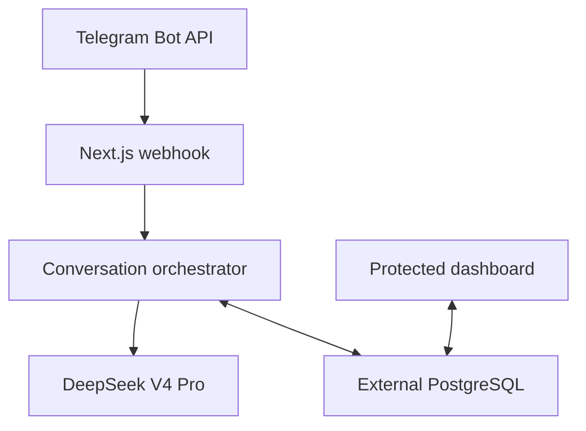

# Design: Telegram Agent

Status: Draft

Approval note: The previous approval was invalidated because the design simultaneously deferred the exact Asian Function region to deployment and required that unknown value in source-controlled `vercel.json`. The corrected design uses Vercel project settings or the deployment CLI for the operator-selected region.

## Design goals

- Deliver the approved public, private-chat Telegram assistant without adding unapproved agent tools or services.
- Preserve every accepted Telegram update and processing checkpoint needed for idempotent, ordered replies.
- Keep all durable state in the supplied PostgreSQL database.
- Make protected operational data inspectable through a simple, accessible, read-only Next.js dashboard.
- Fit Vercel Hobby execution constraints while keeping transport, orchestration, model, persistence, and dashboard concerns separable.
- Keep future tool-enabled agent work possible without placing future abstractions in the MVP request path.

## Verified technical context

| Path or source | Verified constraint or convention |
|---|---|
| `specs/telegram-agent/requirements.md` | Approved greenfield requirements; this document must cover REQ-F-001 through REQ-F-027 and REQ-NF-001 through REQ-NF-011. |
| [Next.js documentation](https://nextjs.org/docs) | The current stable documentation line is Next.js 16.3.x and uses the App Router. |
| [Vercel Function limits](https://vercel.com/docs/functions/limitations) | Hobby Functions have a 300-second maximum duration under the current Fluid Compute model. |
| [Vercel Cron usage](https://vercel.com/docs/cron-jobs/usage-and-pricing) | Hobby cron schedules may run only once per day, so cron cannot provide prompt queue recovery. |
| [Vercel Function region configuration](https://vercel.com/docs/functions/configuring-functions/region) | Functions should run nearest their database; Vercel supports selecting the single Hobby-plan region through project settings or the deployment CLI, so the exact Asian region need not be fixed in source. |
| [Telegram Bot API](https://core.telegram.org/bots/api) | Webhooks are HTTPS POST requests, non-2xx responses are retried, `secret_token` is delivered in `X-Telegram-Bot-Api-Secret-Token`, and ordinary sent text is limited to 4096 characters after entity parsing. |
| [DeepSeek model and pricing documentation](https://api-docs.deepseek.com/quick_start/pricing) | `deepseek-v4-pro` is the stable API model identifier. |
| [DeepSeek thinking-mode documentation](https://api-docs.deepseek.com/guides/thinking_mode/) | Thinking mode accepts `thinking.type`; chat completions return hidden reasoning separately as `reasoning_content`; requested `medium` maps to the provider's `high` effort. |

## Proposed architecture

The system is one Next.js 16 application using the Node.js runtime. Telegram sends updates to a Route Handler. That handler validates the webhook secret and update shape, persists an idempotency record, acquires a PostgreSQL session advisory lock keyed by Telegram user ID, and synchronously completes command handling or the DeepSeek turn before returning a 2xx response. PostgreSQL is the only durable store.

The dashboard uses protected Server Components and server-side queries. Login and logout are POST-only server actions/route handlers. Session state is a signed cookie, so no session table or second datastore is required.



The project is organized under `src/` with narrow public interfaces:

- `src/app/` — dashboard pages, auth endpoints/actions, health route, and Telegram webhook route.
- `src/modules/telegram/` — grammY adapter, update validation, command responses, formatting, and webhook operations.
- `src/modules/conversation/` — per-update orchestration, checkpoints, context assembly, and language/system-prompt policy.
- `src/modules/model/` — provider-neutral model contract and DeepSeek `fetch` implementation.
- `src/modules/db/` — Drizzle schema, repositories, pool/client lifecycle, advisory locking, and migrations.
- `src/modules/auth/` — secret verification and signed-session handling.
- `src/modules/dashboard/` — read-only query services and view models.
- `src/modules/observability/` — structured logs, correlation context, retry classification, and error sanitization.

## Components and responsibilities

| ID | Component | Responsibility | Expected change |
|---|---|---|---|
| DES-001 | Project baseline | Next.js 16, strict TypeScript, Node.js 24, pnpm, linting, formatting, Tailwind, and test configuration. | Create greenfield manifests, configuration, and source layout. |
| DES-002 | Environment configuration | Lazily validate server-only configuration per entry point and expose typed configuration without evaluating secrets during build. | Create server-only schemas/loaders and `.env.example`. |
| DES-003 | PostgreSQL connection layer | Provide a lazily initialized `pg.Pool`, dedicated clients for advisory locks, Drizzle access, and transaction helpers. | Create database module and configuration. |
| DES-004 | Database schema and migrations | Define the six approved tables, constraints, indexes, enums/checks, and explicit versioned migration command. | Create Drizzle schema and initial SQL migration. |
| DES-005 | Telegram webhook boundary | Accept only POST, verify Telegram's secret header before body parsing, validate the update, and route only supported private messages. | Create `/api/telegram/webhook` Route Handler and runtime schemas. |
| DES-006 | Telegram adapter | Encapsulate grammY Bot API operations, typing activity, command/help messages, MarkdownV2 delivery, plain-text fallback, splitting, and API error mapping. | Create Telegram transport module. |
| DES-007 | Idempotency and checkpoints | Insert updates by unique Telegram update ID and resume or exit according to persisted processing state. | Create update repository/state machine. |
| DES-008 | Per-user serialization | Acquire/release a PostgreSQL session advisory lock using Telegram user ID on a dedicated connection for the full turn. | Create lock helper used by the orchestrator. |
| DES-009 | Conversation service | Upsert allowed user fields, maintain one active conversation, implement `/new`, assemble the 20-pair window, and persist messages/status. | Create repositories and orchestration service. |
| DES-010 | Model contract | Define request/response/error types independent of DeepSeek and future tool capabilities. | Create provider-neutral interface. |
| DES-011 | DeepSeek client | Call chat completions with `deepseek-v4-pro`, configurable thinking, requested medium effort, non-streaming response parsing, token usage, and separated hidden reasoning. | Create typed native-`fetch` adapter. |
| DES-012 | Retry and failure service | Classify transient failures, run at most two retries with short jittered backoff, sanitize diagnostics, and produce generic user errors. | Create shared retry/error utilities. |
| DES-013 | Cost accounting | Snapshot per-million input/output prices, token counts, arithmetic inputs, and estimated costs for each model run. | Implement model-run persistence and calculation. |
| DES-014 | Dashboard authentication | Constant-time secret verification, 24-hour stateless HMAC cookie, fail-closed route guard, POST logout, and cookie invalidation. | Create auth module, login page/action, protected layout, and logout action. |
| DES-015 | Dashboard data layer | Expose read-only overview, user, conversation, message, model-run, and error queries with validated search and keyset/offset pagination. | Create query services/view models. |
| DES-016 | Dashboard presentation | Render the approved responsive light-theme routes using Server Components, semantic HTML, Tailwind, accessible navigation/forms/tables, and empty/error states. | Create protected pages and shared UI components. |
| DES-017 | Health and operator scripts | Report minimal process/database readiness and register, inspect, or remove the Telegram webhook without leaking secrets. | Create `/api/health` and TypeScript operator scripts. |
| DES-018 | Observability | Emit structured JSON logs and persist sanitized operational errors with correlation identifiers. | Create logger, error repository, and instrumentation. |
| DES-019 | Test harness | Verify units, real-PostgreSQL behavior, external contracts via mocks, dashboard E2E behavior, accessibility, and 10-conversation isolation. | Create Vitest, PostgreSQL integration, Playwright, and accessibility suites. |
| DES-020 | Deployment and rollback | Configure the 300-second Node.js route, operator-selected Asian region through Vercel settings/CLI, explicit migration, deployment checklist, and backward-compatible rollback. | Create runtime configuration and operational documentation without fixing the region in source. |

## Data models and state

All internal primary keys are UUIDs generated by PostgreSQL or the application. All timestamps are timezone-aware and stored in UTC. Telegram identifiers use `bigint`; application TypeScript types carry them as strings or `bigint`, never lossy JavaScript numbers. Foreign keys use explicit delete restrictions because the application has no deletion behavior.

### `telegram_users`

| Column | Type and rules |
|---|---|
| `id` | UUID primary key. |
| `telegram_user_id` | `bigint`, unique, not null. |
| `username` | nullable text; latest Telegram-supplied value. |
| `language_code` | nullable text; latest Telegram-supplied value. |
| `first_seen_at` | `timestamptz`, immutable after insert. |
| `last_seen_at` | `timestamptz`, updated for accepted private user activity. |

No first-name or last-name columns exist.

### `conversations`

| Column | Type and rules |
|---|---|
| `id` | UUID primary key. |
| `user_id` | UUID foreign key to `telegram_users`. |
| `status` | checked text: `active` or `archived`. |
| `created_at`, `updated_at` | `timestamptz`. |
| `archived_at` | nullable `timestamptz`, required when archived. |

A partial unique index on `user_id WHERE status = 'active'` enforces one active conversation. `(user_id, created_at DESC)` supports history.

### `messages`

| Column | Type and rules |
|---|---|
| `id` | UUID primary key. |
| `conversation_id` | UUID foreign key. |
| `telegram_update_id` | nullable `bigint` reference to `telegram_updates`. |
| `role` | checked text: `user` or `assistant`. |
| `source` | checked text: `user_text`, `command`, `model`, or `system_response`. |
| `content` | full text, not null. |
| `telegram_message_id` | nullable `bigint`; incoming ID or the first outgoing chunk ID. |
| `telegram_message_ids` | nullable `bigint[]`; every delivered output chunk ID. |
| `status` | checked text: `received`, `processing`, `generated`, `sent`, or `failed`. |
| `created_at`, `processed_at` | `timestamptz`, with processed time nullable until terminal. |

Indexes cover conversation chronology, update lookup, status, and recent dashboard sorting. A GIN index over `to_tsvector('simple', content)` supports language-neutral token search without a provider-specific extension.

### `telegram_updates`

| Column | Type and rules |
|---|---|
| `update_id` | Telegram `bigint` primary key and idempotency key. |
| `telegram_user_id`, `chat_id`, `message_id` | nullable `bigint` identifiers retained only for validated routing/checkpoint needs. |
| `kind` | checked text: `text`, `command`, or `unsupported`. |
| `state` | checked text: `received`, `locked`, `prompt_saved`, `model_complete`, `delivery_complete`, or `failed`. |
| `attempt_count` | non-negative integer incremented for each invocation that owns processing. |
| `last_error_stage` | nullable sanitized stage name. |
| `created_at`, `updated_at`, `completed_at` | `timestamptz`; completed time nullable. |

The raw Telegram update is never stored, preventing accidental persistence of first/last names, media, hidden fields, or unsupported content.

### `model_runs`

| Column | Type and rules |
|---|---|
| `id` | UUID primary key. |
| `request_message_id`, `response_message_id` | UUID references to messages; response is nullable until generated. |
| `provider`, `model` | `deepseek` and the exact model identifier. |
| `thinking_enabled`, `requested_reasoning_effort` | applied request settings. |
| `provider_request_id` | nullable sanitized provider identifier. |
| `input_tokens`, `output_tokens` | nullable non-negative `bigint`. |
| `input_price_per_million`, `output_price_per_million` | nullable non-negative `numeric`. |
| `estimated_input_cost`, `estimated_output_cost`, `estimated_total_cost` | nullable non-negative `numeric`; null if usage/pricing is unavailable. |
| `latency_ms` | nullable non-negative integer. |
| `status` | checked text: `started`, `succeeded`, or `failed`. |
| `started_at`, `completed_at` | `timestamptz`. |

Costs use decimal database arithmetic: `tokens * price_per_million / 1_000_000`. A run snapshots applied prices, so later configuration changes do not rewrite history.

### `application_errors`

| Column | Type and rules |
|---|---|
| `id` | UUID primary key. |
| `telegram_update_id`, `model_run_id` | nullable correlation references. |
| `correlation_id` | opaque UUID/text ID safe for logs and UI. |
| `stage`, `error_class`, `error_code` | bounded sanitized identifiers. |
| `safe_message` | bounded text after redaction. |
| `retryable`, `retry_number` | retry classification and zero-based occurrence. |
| `created_at` | `timestamptz`. |

No dashboard-session table, login-attempt table, queue table, raw request body, hidden reasoning, or secret-bearing record is created.

## Interfaces and APIs

### Telegram webhook

- `POST /api/telegram/webhook`
- Node.js runtime, `maxDuration = 300`, dynamic/no-cache behavior.
- Before parsing JSON, compare `X-Telegram-Bot-Api-Secret-Token` with the configured webhook secret using constant-time fixed-length digests.
- Accept a bounded JSON body and validate the update with a runtime schema. The grammY types assist at compile time but do not replace runtime validation.
- Configure Telegram `allowed_updates` to `['message']`; still reject/ignore out-of-scope updates because pending updates may predate configuration.
- Return 200 only after a terminal handled state or an intentionally ignored out-of-scope update. Return a retryable non-2xx status when no safe checkpoint/response has been completed and Telegram redelivery can recover work.
- Never return Telegram or DeepSeek output in the webhook HTTP response body; send through Bot API calls so delivery outcomes are observable.

### Telegram commands and messages

- `/start`: deterministic introduction, with no privacy/retention notice.
- `/help`: deterministic text-only command summary.
- `/new`: archive the active conversation and atomically create a new active conversation.
- Other commands: deterministic unsupported-command/help response; do not call DeepSeek.
- Supported text: trim only for empty-input detection; persist the complete Telegram text and pass it unchanged as user content.
- Empty/unsupported private input: send concise text-only guidance and do not persist unsupported content as a message.
- Group/channel, edited-message, inline, and other update types: acknowledge and ignore without persisting profile or conversational content.

### Model interface

```ts
interface ModelClient {
  generate(request: ModelRequest, signal: AbortSignal): Promise<ModelResponse>
}

interface ModelRequest {
  systemPrompt: string
  messages: Array<{ role: 'user' | 'assistant'; content: string }>
  thinkingEnabled: boolean
  reasoningEffort: 'low' | 'medium' | 'high' | 'max'
}

interface ModelResponse {
  content: string
  providerRequestId?: string
  usage?: { inputTokens: bigint; outputTokens: bigint }
  latencyMs: number
}
```

The DeepSeek request uses `POST https://api.deepseek.com/chat/completions`, bearer authentication, `model: 'deepseek-v4-pro'`, `stream: false`, `thinking: { type: enabled|disabled }`, and `reasoning_effort: 'medium'`. It omits ineffective sampling parameters in thinking mode. The response parser validates the shape, extracts only `message.content`, discards `reasoning_content`, and never logs or persists it.

### Dashboard authentication and routes

- `GET /login` renders the secret form; authenticated visitors redirect to `/dashboard`.
- `POST /login` validates same-origin submission and compares fixed-length HMAC-SHA-256 digests of supplied/configured secrets using the separate signing secret.
- On success, issue a `__Host-telegram-agent-session` cookie containing the expiry timestamp plus its HMAC signature. Cookie attributes: `HttpOnly`, `Secure` in production, `SameSite=Strict`, `Path=/`, `Max-Age=86400`; no `Domain`.
- The protected dashboard layout validates signature and expiry on every request. Invalid/expired cookies are cleared and redirected before queries run.
- `POST /logout` validates same-origin submission and expires the cookie immediately.
- No login attempt is persisted or rate-limited.

Protected GET routes:

- `/dashboard` — totals for users, conversations, messages, successful/failed model runs, token usage, estimated cost, and errors.
- `/dashboard/users` — users; search Telegram ID/username/language.
- `/dashboard/conversations` — conversations; search ID/user identifiers/status.
- `/dashboard/conversations/[id]` — metadata and complete chronological message history.
- `/dashboard/messages` — messages; search content/IDs/role/status.
- `/dashboard/model-runs` — run status, settings, tokens, snapshot prices, cost, latency, and correlations.
- `/dashboard/errors` — sanitized error stage/class/code/message and correlations.

All list routes validate `q` and `page` search parameters, use 50 rows per page, impose deterministic newest-first ordering with UUID/ID tie-breakers, and bind query parameters. Invalid pages normalize to page 1. Responses use `Cache-Control: private, no-store` and protected Server Components opt out of caching.

### Health and operator commands

- `GET /api/health` returns `200 { status: 'ready' }` after a bounded `SELECT 1`, or `503 { status: 'not_ready' }`; it exposes no exception, identifier, version, or configuration value.
- `pnpm telegram:webhook:set` registers `${APP_URL}/api/telegram/webhook` with the configured secret, `allowed_updates: ['message']`, and does not drop pending updates.
- `pnpm telegram:webhook:info` prints sanitized `getWebhookInfo` status.
- `pnpm telegram:webhook:delete` removes the webhook without dropping pending updates by default.
- `pnpm db:migrate` runs versioned migrations explicitly.

### Environment variables

`.env.example` documents, without values:

- Required: `DATABASE_URL`, `TELEGRAM_BOT_TOKEN`, `TELEGRAM_WEBHOOK_SECRET`, `DEEPSEEK_API_KEY`, `DASHBOARD_SECRET`, `SESSION_SIGNING_SECRET`, `APP_URL`, `DEEPSEEK_INPUT_PRICE_PER_MILLION`, `DEEPSEEK_OUTPUT_PRICE_PER_MILLION`.
- Optional with defaults: `ASSISTANT_SYSTEM_PROMPT`, `DEEPSEEK_THINKING_ENABLED=true`, `DEEPSEEK_REASONING_EFFORT=medium`, `DEEPSEEK_BASE_URL=https://api.deepseek.com`, `DATABASE_POOL_MAX=10`.
- Deployment setting: an operator-selected supported Asian Vercel Function region nearest the database, configured through Vercel project settings or the deployment CLI; it is neither fixed in source nor guessed from an environment variable.

The model identifier is fixed in code for this approved release. Environment values are parsed only inside the server entry point that needs them, preventing missing production secrets from breaking unrelated static build evaluation.

## Key flows

### 1. Successful conversational turn

1. Verify webhook method and secret, parse and validate the update, and reject out-of-scope chat/update types.
2. Insert `telegram_updates(update_id, state='received')` with conflict-safe semantics.
3. Check out a dedicated PostgreSQL client and acquire `pg_advisory_lock(telegram_user_id)`; release in `finally`, then release the client.
4. Re-read the update state under the lock. Exit if `delivery_complete`; otherwise increment attempt count and resume at the persisted checkpoint.
5. Upsert only the approved user fields, create/find the active conversation, and persist the incoming message in one transaction; mark `prompt_saved`.
6. Load the latest 20 user/assistant pairs in chronological order, prepend the current configured system prompt, persist a `started` model run, and send Telegram typing activity.
7. Call DeepSeek with an abort deadline that leaves time before the Vercel invocation deadline for persistence and Telegram delivery.
8. Validate the response; in one transaction store the assistant message, final model-run usage/pricing/cost metadata, and `model_complete` checkpoint.
9. Split/sanitize the final answer and send chunks sequentially. Store returned Telegram message IDs and mark message/update `sent`/`delivery_complete`.
10. Return HTTP 200 and release the per-user lock.

### 2. Duplicate or resumed update

1. The unique update insert conflicts harmlessly.
2. The duplicate waits for the same per-user advisory lock.
3. If state is `delivery_complete`, return 200 without calling DeepSeek or Telegram.
4. If `model_complete`, reuse the persisted assistant response and retry only Telegram delivery.
5. If `prompt_saved` without a successful model run, retry/resume model processing without inserting a duplicate prompt.
6. If no safe checkpoint exists, continue the normal flow. A provider call lost before its response was persisted may be repeated, but only one persisted/delivered assistant response is allowed.

### 3. Commands

1. Acquire the same per-user lock and idempotency state.
2. `/new` archives the active conversation and creates the replacement atomically; other commands preserve it.
3. Persist command and deterministic response messages with command/system-response sources.
4. Deliver once, checkpoint, and return 200 without a model run.

### 4. Dashboard request

1. The protected layout validates the signed cookie and expiry before fetching data.
2. The page validates query parameters and runs parameterized, read-only PostgreSQL queries concurrently where independent.
3. The Server Component renders semantic, responsive output with explicit empty/error states and no client polling.

## Error handling

- Retry at most twice after the initial attempt, using full jitter around 250 ms and 1000 ms delays while respecting the Vercel deadline.
- Treat network resets/timeouts, PostgreSQL connection/serialization/deadlock errors, HTTP 408/429, and provider HTTP 5xx as transient. Honor bounded Telegram `retry_after` data when it fits the remaining deadline.
- Do not retry authentication, authorization, invalid-request, schema-validation, or other deterministic 4xx failures.
- Persist each retryable or terminal failure in `application_errors` when PostgreSQL is available; otherwise emit only sanitized structured logs.
- If PostgreSQL fails before the update idempotency row is durable, do not call DeepSeek; return non-2xx so Telegram can redeliver.
- If DeepSeek fails after retries, persist failed states, send the generic retry-later message if Telegram is available, checkpoint its delivery, and return 200.
- If response persistence succeeds but Telegram delivery fails, retain `model_complete` and return non-2xx after retries so a redelivery can resend without another model call.
- If MarkdownV2 delivery fails due to entity parsing, retry that chunk once as plain text without regenerating content; transport retries remain bounded by the two-retry policy.
- Validate final model content as non-empty. Empty/malformed success responses are provider failures and follow the DeepSeek failure path.
- Error sanitization removes bearer tokens, cookies, connection URLs, query parameter secrets, request bodies, raw provider responses, and stack details before database insertion or user display.

## Security and privacy

- Trust boundaries are Telegram-to-webhook, application-to-DeepSeek, application-to-PostgreSQL, and browser-to-dashboard.
- The webhook secret is independent from the Telegram bot token, dashboard secret, and session signing secret.
- All secret comparisons use constant-time comparison over fixed-length keyed digests; malformed/missing values fail closed.
- Secrets and database clients are imported only in server-only modules. Client Components receive display view models, never credentials or raw exception objects.
- Dashboard routes and actions validate sessions independently; the layout is defense in depth, not the only authorization check.
- Login/logout are POST and same-origin checked. The strict `__Host-` cookie reduces cross-site and subdomain exposure.
- Protected pages set no-store behavior, deny framing, use a restrictive Content Security Policy, set `Referrer-Policy: no-referrer`, and avoid third-party browser scripts.
- Database queries are parameterized. Search input is bounded and escaped for its selected query operator.
- Raw webhook payloads are short-lived in process memory only. Persisted profile fields are limited to Telegram ID, username, language code, and first/last seen times.
- Hidden DeepSeek `reasoning_content` is immediately discarded after response validation and is excluded from logs, database types, dashboard view models, and later context.
- The accepted absence of dashboard throttling, user rate limits, retention expiry, and privacy notice remains explicit in risk documentation; the design does not silently add them.

## Performance and reliability

- All server execution uses the Node.js runtime; Edge runtime is not used for PostgreSQL sessions or model calls.
- The Telegram webhook has a 300-second maximum duration. The model request is aborted early enough to reserve a fixed finalization window for persistence and delivery.
- The production Vercel Function region is selected at deployment through Vercel project settings or the deployment CLI from supported Asian regions to be closest to the external PostgreSQL host.
- `pg.Pool` initializes lazily and defaults to 10 connections per warm instance; `DATABASE_POOL_MAX` may tune provider compatibility. Pool waiters queue rather than receiving an application quota error.
- Session advisory locks serialize only one Telegram user; distinct users proceed independently. The lock connection is always released in `finally` or by PostgreSQL when an invocation terminates.
- Queries use indexes for update IDs, user identifiers, conversation chronology/status, message chronology/status/search, model-run times/status, and error times/stage.
- Dashboard pages fetch 50 rows, select only displayed columns, and load large message bodies only on message/conversation views.
- The system provides best-effort operation with no formal SLA. It relies on Telegram redelivery plus database checkpoints rather than Hobby cron or an unapproved queue.

## Observability

- Each invocation establishes a correlation context containing an application correlation ID, Telegram update ID when safe, internal message/model-run IDs, stage, attempt, duration, and terminal state.
- Structured JSON logs use levels and stable event names; no raw message content, user profile payload, secret, cookie, URL credentials, headers, or hidden reasoning appears in logs.
- `model_runs` provides status, timing, model, thinking configuration, usage, price snapshot, and estimated cost.
- `application_errors` provides dashboard-safe failure classification and correlations.
- The health endpoint supplies a minimal readiness signal. No third-party monitoring, metrics, tracing, or alerts are introduced.

## Testing strategy

- Unit tests with Vitest cover environment parsing, context-window selection, language instruction composition, command parsing, message splitting, Markdown fallback, cost arithmetic, retry classification/backoff, error redaction, session signing/expiry, and search parameter validation.
- Contract tests mock Telegram and DeepSeek HTTP endpoints while validating outbound headers/bodies and parsing representative success, usage-omitted, reasoning, malformed, 4xx, 429, and 5xx responses.
- PostgreSQL integration tests use an ephemeral real PostgreSQL instance to run migrations and verify unique/partial indexes, foreign keys, full-text search, cost numerics, session advisory lock serialization/release, idempotent inserts, checkpoints, and `/new` atomicity.
- Concurrency tests drive at least 10 simultaneous distinct conversations plus overlapping messages for one user and assert zero cross-user context leakage, ordered same-user replies, and at-most-one delivered response per update.
- Next.js integration tests verify protected queries fail closed, no-store headers, health readiness, and webhook status behavior.
- Playwright tests cover login, invalid login, 24-hour session behavior using a controlled clock, logout, every dashboard route, search, pagination, empty states, narrow 320px layout, keyboard navigation, visible focus, and automated WCAG checks.
- Security tests scan built client output and captured logs/responses for seeded secrets, first/last names, raw authorization values, connection strings, and hidden reasoning.
- Build verification runs type checking, linting, formatting checks, unit/integration tests, and `next build`. External live API tests are opt-in and never part of ordinary CI.

## Migration, rollout, and rollback

1. Create the external PostgreSQL database and confirm TLS connectivity, permissions, and capacity from the selected Asian Vercel region.
2. Configure all required Vercel environment variables and select the supported Asian Function region closest to the database through Vercel project settings or the deployment CLI.
3. Run `pnpm db:migrate` explicitly against the target database; do not run migrations in `next build`, application startup, or a request.
4. Deploy the application, validate `/api/health`, and log into the dashboard before accepting Telegram traffic.
5. Register the Telegram webhook using the operator script without dropping pending updates; inspect webhook status.
6. Run a private smoke test for `/start`, `/help`, `/new`, a normal model turn, persistence, and dashboard visibility.
7. Monitor Vercel logs, Telegram webhook status, dashboard model runs, and errors during initial operation.

Future migrations remain additive/backward-compatible. Application rollback restores the previous Vercel deployment while leaving the compatible schema. No automatic down-migration or database restore occurs. Database backup/restore is the external PostgreSQL operator's responsibility. Before a rollback that changes webhook behavior, keep the same endpoint/secret contract or explicitly remove the webhook.

## Alternatives considered

| Alternative | Advantages | Disadvantages | Reason rejected |
|---|---|---|---|
| Immediate webhook acknowledgement plus `waitUntil` background generation | Fast Telegram acknowledgement. | A terminated background invocation can strand work after Telegram has already received 2xx; Hobby cron cannot recover promptly. | Synchronous processing plus Telegram redelivery offers a clearer recovery contract. |
| PostgreSQL job queue plus frequent Vercel cron worker | Durable asynchronous work. | Hobby cron can run only daily, which is unsuitable for chat latency. | Conflicts with the required plan. |
| Redis/external queue or Vercel Workflow | Better durable orchestration at scale. | Adds a service/store and scope beyond the approved MVP. | Explicitly excluded by requirements. |
| Telegram long polling | Straightforward on a persistent process. | Poor fit for stateless Vercel Functions and conflicts with webhook-oriented serverless deployment. | Webhooks fit Next.js Route Handlers and Telegram redelivery. |
| Raw Telegram Bot API without grammY | Fewer dependencies and total protocol control. | More update/API plumbing and less ergonomic test setup. | grammY was confirmed while orchestration remains decoupled. |
| OpenAI SDK or a general AI SDK for DeepSeek | Familiar abstractions and helpers. | V4-specific `thinking`/reasoning fields and hidden reasoning handling become less explicit. | A small native-fetch adapter is simpler and was confirmed. |
| Prisma ORM | Rich generated client and ecosystem. | Heavier serverless client and less direct control for session advisory locks. | Drizzle plus `node-postgres` was confirmed. |
| Database-backed dashboard sessions | Server-side revocation and audit. | Adds session state and tables despite the simple shared-secret model. | Stateless HMAC sessions were confirmed. |
| Fixed Singapore deployment | Concrete configuration. | May be far from the still-unspecified Asian database location. | The user chose deployment-time selection of the closest supported Asian region. |

## Design risks

| ID | Risk | Mitigation |
|---|---|---|
| DRISK-001 | A DeepSeek turn may exceed the 300-second Hobby Function duration. | Abort before the platform deadline, checkpoint failures, send a generic response if possible, and rely on best-effort semantics. |
| DRISK-002 | Holding a PostgreSQL session connection during model inference can consume external database connections. | Use a configurable bounded pool, lock only per user, release in `finally`, and verify 10-conversation behavior against a real database. |
| DRISK-003 | A provider response can be generated but lost before the `model_complete` checkpoint, causing a repeated paid call. | Persist immediately after validation; permit repeated provider work only when no reusable response is durable, while preventing duplicate delivery. |
| DRISK-004 | The deployment-selected Asian region may still be far from the database. | Document region selection and validate database latency during rollout before webhook registration. |
| DRISK-005 | No rate limits or login throttling allows cost abuse and secret brute force. | Accepted upstream; keep strong-secret guidance, no secret leakage, and comprehensive usage/error visibility. |
| DRISK-006 | Full-text search over indefinitely retained message content can grow expensive. | Use a native GIN index, 50-row pages, deterministic indexes, and select bounded result sets; no runtime cap is imposed. |
| DRISK-007 | The external PostgreSQL provider may terminate long-held or idle sessions. | Configure pool health checks, retry transient connection errors, checkpoint before external calls, and surface sanitized errors. |
| DRISK-008 | Telegram MarkdownV2 differs from model Markdown. | Normalize supported formatting, split conservatively, and fall back to plain text without regeneration. |
| DRISK-009 | Current external API or framework behavior can change. | Pin dependencies, validate response schemas, keep adapters narrow, and reference current official contracts in tests/docs. |

## Requirements traceability

| Requirement | Design decisions | Coverage explanation |
|---|---|---|
| REQ-F-001 | DES-005, DES-006, DES-009 | The validated private-message webhook and Telegram adapter accept public user text and route it to isolated conversations. |
| REQ-F-002 | DES-005, DES-006, DES-009 | Routing and deterministic command handlers limit the interface to approved text/commands. |
| REQ-F-003 | DES-006 | Deterministic `/start` and `/help` content follows the approved disclosure boundary. |
| REQ-F-004 | DES-004, DES-009 | Conversation service plus partial unique index enforces one active conversation. |
| REQ-F-005 | DES-008, DES-009 | Per-user locking and atomic conversation replacement implement `/new`. |
| REQ-F-006 | DES-009, DES-010, DES-011 | Context assembly selects 20 pairs plus the configured system prompt for the model contract. |
| REQ-F-007 | DES-011 | DeepSeek adapter fixes `deepseek-v4-pro`. |
| REQ-F-008 | DES-002, DES-011, DES-013 | Typed settings control thinking; response parsing excludes hidden reasoning while run metadata records applied public settings. |
| REQ-F-009 | DES-002, DES-009 | Lazy configuration provides the prompt and the conversation service prepends it. |
| REQ-F-010 | DES-009, DES-010 | Orchestration includes language-following policy in model input. |
| REQ-F-011 | DES-007, DES-008, DES-009 | Advisory locking, checkpoints, and conversation processing preserve same-user order. |
| REQ-F-012 | DES-006, DES-011 | Telegram adapter handles typing, formatting/splitting, and one non-streamed model answer. |
| REQ-F-013 | DES-007, DES-012, DES-018 | Retry classifier, checkpoints, generic errors, and sanitized records cover transient failure behavior. |
| REQ-F-014 | DES-004, DES-007, DES-008 | Unique update IDs plus locked checkpoint resumption prevent duplicate prompts/replies. |
| REQ-F-015 | DES-004, DES-009 | The user table and upsert persist exactly the approved profile fields. |
| REQ-F-016 | DES-004, DES-005, DES-009 | Schema omits names and raw payloads are never persisted. |
| REQ-F-017 | DES-004, DES-009, DES-011, DES-013 | Message/model-run schemas and orchestration persist every approved field. |
| REQ-F-018 | DES-004, DES-015 | No expiry/deletion path exists and dashboard queries retain access to durable history. |
| REQ-F-019 | DES-002, DES-014 | Server-side secret validation gates the dashboard. |
| REQ-F-020 | DES-014 | The HMAC cookie has 24-hour expiry and POST logout. |
| REQ-F-021 | DES-002, DES-014, DES-018 | Secret routing, cookie design, and redaction exclude the secret from URLs/storage/logs. |
| REQ-F-022 | DES-015, DES-016 | Read-only queries and routes expose all approved dashboard categories. |
| REQ-F-023 | DES-004, DES-015, DES-016 | Search indexes, validated queries, and 50-row pages make records navigable. |
| REQ-F-024 | DES-015, DES-016 | Dynamic Server Components refresh only on navigation/manual refresh and contain no polling. |
| REQ-F-025 | DES-002, DES-004, DES-013 | Environment prices and decimal snapshot arithmetic provide historical estimates. |
| REQ-F-026 | DES-005, DES-014, DES-015 | No quota, throttle, lockout, CAPTCHA, or traffic gate is designed. Pagination and connection pools manage resources without rejecting by quota. |
| REQ-F-027 | DES-006, DES-009, DES-010 | Separate transport, orchestration, and model contract preserve future extension points without implementing tools. |
| REQ-NF-001 | DES-001, DES-003, DES-020 | Baseline, generic PostgreSQL access, and Vercel deployment configuration satisfy the platform stack. |
| REQ-NF-002 | DES-008, DES-009, DES-019 | Per-user locking and the concurrency test demonstrate isolation across 10 conversations. |
| REQ-NF-003 | DES-002, DES-005, DES-011, DES-014, DES-018 | Server-only config, boundary validation, auth, and redaction protect secrets. |
| REQ-NF-004 | DES-014, DES-019 | Fail-closed session validation and auth tests guard every protected route. |
| REQ-NF-005 | DES-004, DES-005, DES-018 | Restricted schema, no raw updates, and sanitization implement privacy constraints. |
| REQ-NF-006 | DES-007, DES-008, DES-012 | Checkpoints, advisory locks, and bounded retries provide required reliability invariants. |
| REQ-NF-007 | DES-004, DES-013, DES-018 | Model runs, messages, and errors retain the approved diagnostic metadata. |
| REQ-NF-008 | DES-016, DES-019 | Semantic UI, keyboard/focus/contrast design, and automated/manual accessibility tests cover WCAG behavior. |
| REQ-NF-009 | DES-016, DES-019 | Responsive components and Playwright browser/320px checks cover compatibility. |
| REQ-NF-010 | DES-003, DES-006, DES-009, DES-010, DES-015, DES-019 | Separately testable persistence, transport, orchestration, model, and dashboard boundaries implement extensibility. |
| REQ-NF-011 | DES-012, DES-018, DES-020 | Best-effort deployment, bounded retries, generic failures, and diagnostics express the no-SLA decision. |
