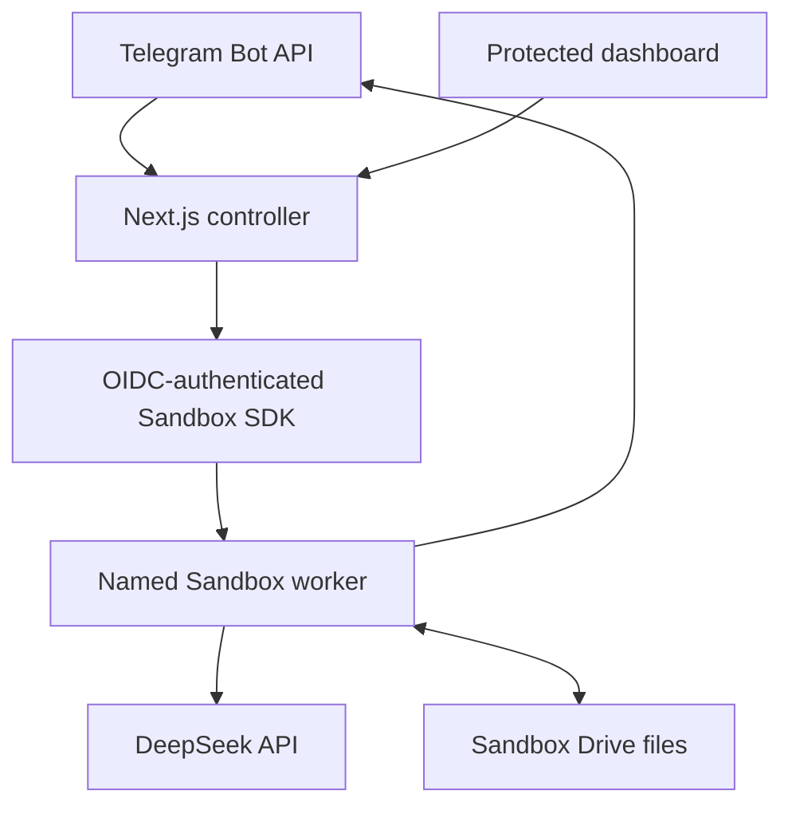

# Design: Telegram Agent on Vercel Sandbox Drive

Status: Approved

## Design goals

- Deliver the approved public Telegram assistant, protected dashboard, and archive download without adding a database or another durable store.
- Keep every durable application record as an ordinary file on one Vercel Sandbox Drive in Singapore (`sin1`).
- Preserve per-user ordering, duplicate-update safety, atomic file mutation, crash recovery, and cross-user concurrency.
- Keep Vercel Sandbox inaccessible through public ports; all controller-to-Sandbox communication uses the authenticated Vercel SDK and worker commands.
- Make stopped or replaced Hobby-plan Sandbox sessions recover from the Drive without treating the Sandbox root filesystem as durable application storage.
- Stream consistent archives without loading the complete ZIP into Next.js Function memory.
- Keep Telegram transport, conversation orchestration, model access, file persistence, dashboard querying, and future agent tools separable.

## Verified technical context

| Path or source | Verified constraint or convention |
|---|---|
| `specs/telegram-agent/requirements.md` | Approved greenfield requirements covering REQ-F-001 through REQ-F-034 and REQ-NF-001 through REQ-NF-016. |
| `specs/telegram-agent/design.md` | This draft design, derived from the approved requirements and awaiting explicit approval. |
| [Vercel Sandbox Drive](https://vercel.com/docs/sandbox/concepts/drives) | Drive files survive Sandbox stops; one Sandbox may mount a Drive read-write at a time; read-only snapshots may have multiple readers; Hobby defaults the Drive maximum to 1 GiB. |
| [Vercel Sandbox regions](https://vercel.com/docs/sandbox/concepts/regions) | A Drive and its mounting Sandbox must use the same immutable region; `sin1` is Singapore; Drive-mounted Sandboxes cannot use failover regions. |
| [Vercel Sandbox SDK](https://vercel.com/docs/sandbox/sdk-reference) | `Drive.getOrCreate`, `Sandbox.getOrCreate`, named persistent Sandboxes, mounted Drives, worker commands, per-command environment variables, and streamed `sandbox.readFile()` are supported. |
| [Vercel Sandbox authentication](https://vercel.com/docs/sandbox/concepts/authentication) | Vercel deployments receive managed OIDC authentication automatically; local development uses the 12-hour token obtained by `vercel link` and `vercel env pull`. |
| [Vercel Sandbox pricing and quotas](https://vercel.com/docs/sandbox/pricing) | Hobby compute, creation, transfer, Drive I/O, and session-duration quotas make the service best-effort. |
| [Telegram Bot API](https://core.telegram.org/bots/api) | Telegram webhooks use HTTPS POST delivery, support a secret-token header, retry non-2xx results, and limit sent text length. |
| Repository inspection | Greenfield workspace: no application source, package manifest, schema, migration, or test convention exists yet. |

## Proposed architecture

The production system is one Next.js App Router deployment using the Node.js runtime plus one named, persistent Vercel Sandbox. The Sandbox mounts one named Drive read-write at `/workspace`; all durable application data is beneath `/workspace/telegram-agent/data`.

Next.js owns the public HTTP boundary: Telegram webhook validation, dashboard authentication, dashboard pages, and `GET /api/download`. A server-only Sandbox controller authenticates through Vercel OIDC, retrieves or creates the named `sin1` Drive and Sandbox, validates their immutable configuration, installs the versioned worker bundle into the Sandbox's non-Drive filesystem, and invokes worker commands.

The Sandbox worker owns every operation that reads or mutates Drive data. It receives sanitized request files through the Sandbox SDK, not command-line arguments; returns typed response files or an archive path; and removes request/response temporaries. It exposes no port. Concurrent worker commands use per-user locks for complete conversation turns and one global lock-backed mutation queue for short, durable writes.



The greenfield source layout is:

- `src/app/` — login, protected dashboard pages, Telegram webhook, archive, logout, and health Route Handlers.
- `src/server/auth/` — administrator-secret comparison, signed session cookies, bearer authentication, and route guards.
- `src/server/sandbox/` — Drive/Sandbox lifecycle, OIDC-aware SDK adapter, worker installation, command transport, timeouts, and stream bridging.
- `src/server/telegram/` — webhook validation and extraction of the minimal allowed Telegram update.
- `src/shared/` — runtime schemas, typed contracts, IDs, error codes, and redaction utilities shared by Next.js and the worker.
- `src/worker/` — command dispatcher, Telegram adapter, conversation orchestration, DeepSeek adapter, file store, locks, projections, querying, export, and recovery.
- `tests/` — local file-store integration, controller mocks, contract tests, dashboard E2E, accessibility, and gated live Vercel tests.

## Components and responsibilities

| ID | Component | Responsibility | Expected change |
|---|---|---|---|
| DES-001 | Project baseline and configuration | Establish current stable Next.js App Router, strict TypeScript, Node.js runtime, pnpm, lint/format/test tooling, server-only environment validation, and documented environment variables. | Create greenfield manifests, configuration, `.env.example`, and source layout. |
| DES-002 | Public Next.js boundaries | Implement the Telegram webhook, login/logout, protected dashboard, health, and download routes with Node.js runtime, no-store responses, platform-compatible request parsing, and sanitized errors. | Create `src/app` routes, layouts, pages, and route-level configuration. |
| DES-003 | Dashboard and download authentication | Compare arbitrary non-empty administrator secrets using fixed-length keyed digests; issue a 24-hour signed cookie; accept that cookie or an exact bearer credential for downloads. | Create `src/server/auth` and protected-route guards. |
| DES-004 | Sandbox controller | Use automatic production OIDC or local `VERCEL_OIDC_TOKEN`; retrieve/create and validate the named Drive and named Sandbox in `sin1`; mount the Drive at `/workspace`; never expose a port. | Create `src/server/sandbox/controller.ts` and SDK adapter. |
| DES-005 | Sandbox lifecycle and worker bootstrap | Use `Sandbox.getOrCreate` with `resume: true`, persistent sessions, the Hobby-compatible timeout, and one retained runtime snapshot; upload a build-hashed standalone worker bundle when missing or stale. | Create bundle build step, traced deployment asset, bootstrap marker, and resume validation. |
| DES-006 | Private command protocol | Upload schema-validated request JSON to a unique Sandbox temporary path, execute a named worker operation with secrets passed only as per-command environment variables, validate its response, and clean temporary files. | Create request/response contracts, dispatcher, and transport. |
| DES-007 | Drive layout and versioned event schema | Own the canonical directory structure, monthly UTC JSONL partitions, event envelopes, small materialized JSON state, manifest, and schema-version compatibility. | Create `src/worker/persistence/layout.ts` and schemas. |
| DES-008 | Lock coordinator | Hold a stable per-user lock for the complete turn and a global mutation lock only while appending/syncing events and atomically replacing state; enforce one lock order. | Create Drive-backed, crash-recoverable lock helpers and contention behavior. |
| DES-009 | Atomic event store and projections | Append one complete JSON line under the mutation lock, fsync it, then atomically update rebuildable state; validate tails and rebuild projections after interruption. | Create event writer, atomic JSON writer, projector, validator, and recovery commands. |
| DES-010 | Telegram webhook boundary | Verify Telegram's secret header before processing, validate the body within Telegram/Vercel platform constraints, accept supported private text/commands, extract only approved fields, and avoid forwarding raw updates. | Create `src/app/api/telegram/webhook/route.ts` and Telegram input schemas. |
| DES-011 | Telegram transport adapter | Send typing activity, deterministic command/help replies, non-streamed model results, Telegram-compatible formatting, safe chunking, plain-text fallback, and mapped delivery failures. | Create worker-side Telegram Bot API client using server-side `fetch`. |
| DES-012 | Idempotency and update checkpoints | Use Telegram `update_id` as the durable deduplication key; resume from recorded checkpoints without duplicating a prompt, model response, or delivery. | Create update event/state repository and state machine. |
| DES-013 | Conversation service | Upsert only approved user fields, maintain one active conversation, implement `/new`, assemble the 20-pair context, and preserve per-user arrival order. | Create user, conversation, and message services. |
| DES-014 | Provider-neutral model contract | Define model requests/responses/errors independently from Telegram, DeepSeek, persistence, and future tools. | Create shared model interfaces and test doubles. |
| DES-015 | DeepSeek adapter | Call `deepseek-v4-pro` non-streaming with configured prompt, thinking state, and medium reasoning effort; retain only final content and usage; discard hidden reasoning. | Create worker-side DeepSeek client and response validation. |
| DES-016 | Retry and failure policy | Classify transient failures, perform no more than two retries with bounded jitter, respect invocation deadlines, persist sanitized failures, and produce the generic user response. | Create retry, deadline, classification, and redaction utilities. |
| DES-017 | Usage and cost accounting | Persist provider token counts, applied price snapshots, latency, model/settings, and decimal cost estimates without fabricating missing usage. | Create model-run events and projection logic. |
| DES-018 | Dashboard query service | Read only materialized state and event partitions, compute overview totals, validate search/page inputs, return deterministic pages, and expose complete conversation history without mutation. | Create worker query commands and server-side dashboard view models. |
| DES-019 | Dashboard presentation | Render accessible responsive overview, users, conversations, messages, usage, and errors with semantic Server Components, manual refresh, search, pagination, and no charts or polling. | Create protected pages and reusable UI components. |
| DES-020 | Consistent archive service | Wait for the mutation lock, fsync/close committed files, copy the complete data root to Sandbox temporary storage, release the lock, create a timestamped ZIP, and stream it through `sandbox.readFile()`. | Create worker export operation and `GET /api/download`. |
| DES-021 | Observability | Correlate webhook, worker command, update, model run, and delivery identifiers; emit sanitized structured logs and durable error events without secrets or hidden reasoning. | Create shared logger, safe error envelope, and error projection. |
| DES-022 | Test architecture | Run most tests against a temporary local filesystem and mocked Sandbox controller; gate real Drive/OIDC tests to an authorized Vercel Preview environment. | Create unit, integration, contract, concurrency, recovery, E2E, and live-preview suites. |
| DES-023 | Deployment and operations | Document OIDC setup, `sin1` creation, environment validation, Preview verification, Telegram webhook registration, quota inspection, rollback, and non-destructive recovery. | Create operator scripts and deployment/runbook documentation. |
| DES-024 | Future capability boundary | Reserve a tool-capability interface after model orchestration without implementing web search, MCP, function calling, or code execution. | Create interfaces only; no tool implementations or UI. |

## Data models and state

### Drive directory layout

```text
/workspace/telegram-agent/
├── data/
│   ├── manifest.json
│   ├── records/
│   │   ├── users/YYYY-MM.jsonl
│   │   ├── conversations/YYYY-MM.jsonl
│   │   ├── messages/YYYY-MM.jsonl
│   │   ├── updates/YYYY-MM.jsonl
│   │   ├── model-runs/YYYY-MM.jsonl
│   │   └── errors/YYYY-MM.jsonl
│   ├── state/
│   │   ├── users/<user-key>.json
│   │   ├── conversations/<conversation-id>.json
│   │   ├── messages/<message-id>.json
│   │   ├── updates/<update-id>.json
│   │   ├── model-runs/<run-id>.json
│   │   └── summary.json
│   └── recovery/
│       └── quarantine/
└── runtime/
    └── locks/
```

Only `data/` is application data and is included in downloads. `runtime/` contains coordination artifacts and may be recreated. Worker code, request files, response files, and generated ZIPs stay outside the Drive in the Sandbox's temporary/runtime filesystem.

JSONL files rotate by UTC month to keep individual files inspectable without imposing a retention or storage limit. File names are deterministic. No record is deleted during rotation.

### Event envelope

Every JSONL line is UTF-8 JSON followed by exactly one newline:

```ts
interface EventEnvelope<T> {
  schemaVersion: 1
  eventId: string          // UUIDv7
  eventType: string
  entityId: string
  entityRevision: number
  occurredAt: string       // ISO-8601 UTC
  correlationId: string
  payload: T
}
```

The payload is validated before the mutation lock is acquired. The writer opens the selected partition in append mode, writes the complete serialized line, calls `fsync`, and closes the handle before updating projections.

### User events and state

The latest user state contains only:

- `telegramUserId` as a decimal string;
- nullable `username`;
- nullable `languageCode`;
- immutable `firstSeenAt`;
- latest `lastSeenAt`;
- `revision` and `sourceEventId`.

No first name, last name, raw Telegram user object, or unsupported-content payload is accepted by the schema.

### Conversation and message events

- Conversation state: UUIDv7 ID, Telegram user key, `active|archived`, created/updated/archived timestamps, and revision.
- Message state: UUIDv7 ID, conversation ID, `user|assistant` role, complete text, source, Telegram update/message identifiers when applicable, `received|processing|generated|sent|failed` status, Telegram delivery IDs, timestamps, and revision.
- A small per-user active-conversation pointer is stored under the user state directory and is rebuilt from conversation events.

### Update checkpoints

Each Telegram update has a small JSON state document keyed by its decimal-string `update_id`:

- minimal routing identifiers;
- kind: `text|command|unsupported`;
- state: `received|prompt_saved|model_complete|delivery_complete|failed`;
- attempt count;
- user/conversation/message/model-run correlations;
- sanitized last-error stage;
- timestamps and source event ID.

The raw Telegram update is never written to the Drive. A duplicate waits for the same user lock and resumes from this state.

### Model runs, usage, and errors

- Model-run state records provider, model, thinking setting, requested effort, status, request/response message IDs, nullable provider request ID, nullable input/output tokens, applied per-million prices, decimal estimates, latency, timestamps, and sanitized failure class.
- Error events contain correlation IDs, stage, bounded class/code/message, retryability, retry number, and timestamp.
- Hidden reasoning, provider authorization material, raw error bodies, stack traces, cookies, and environment values are excluded by schema and redaction.

### Atomic projection replacement and recovery

State files are derived views, not independent sources of truth. Replacement uses a same-directory temporary file, file sync, atomic rename, and parent-directory sync. The source event is committed first. If interruption occurs between event append and projection replacement, replaying committed events repairs the projection.

At first use after Sandbox create/resume, the worker:

1. validates `manifest.json` and the last record of every active JSONL partition;
2. moves only an invalid partial tail into `data/recovery/quarantine/` and truncates to the last complete newline;
3. validates projection schema/revision markers;
4. replays affected streams when a state file is absent, malformed, or behind its source events;
5. records a sanitized recovery event after the store is writable.

Previously committed complete lines are never silently discarded.

## Interfaces and APIs

### Environment variables

`.env.example` documents names without secret values.

Required application configuration:

- `TELEGRAM_BOT_TOKEN`
- `TELEGRAM_WEBHOOK_SECRET`
- `DEEPSEEK_API_KEY`
- `DASHBOARD_SECRET`
- `SESSION_SIGNING_SECRET`
- `APP_URL`
- `DEEPSEEK_INPUT_PRICE_PER_MILLION`
- `DEEPSEEK_OUTPUT_PRICE_PER_MILLION`
- `SANDBOX_DRIVE_NAME`
- `SANDBOX_NAME`

Optional configuration with validated defaults:

- `ASSISTANT_SYSTEM_PROMPT`
- `DEEPSEEK_THINKING_ENABLED=true`
- `DEEPSEEK_REASONING_EFFORT=medium`
- `DEEPSEEK_BASE_URL=https://api.deepseek.com`

`SANDBOX_REGION` may be documented but, if supplied, must equal `sin1`; the controller always passes `sin1` explicitly. Production OIDC is automatic. Local development obtains `VERCEL_OIDC_TOKEN` through `vercel env pull`; it is never committed. External-CI access-token variables are not required for the approved production/local workflow.

Configuration is validated lazily in the server/worker entry point that needs it so a missing runtime secret does not expose values or cause unrelated static build evaluation to import secret-bearing modules.

### Sandbox lifecycle contract

`ensureSandbox()`:

1. obtains the named Drive using `Drive.getOrCreate({ name, region: 'sin1' })`;
2. rejects an existing Drive whose region is not `sin1`;
3. obtains the named Sandbox using `Sandbox.getOrCreate({ name, resume: true, region: 'sin1', mounts: { '/workspace': drive }, persistent: true, ... })`;
4. rejects a returned Sandbox whose region or mount does not match;
5. does not configure ports or failover regions;
6. validates/installs the current build-hashed worker bundle outside `/workspace`;
7. runs lightweight Drive validation once per resumed session before serving commands.

Because creation parameters are ignored when a named Sandbox already exists, validation is mandatory rather than assuming `getOrCreate` changed its configuration. A stale/expired Sandbox may be recreated with the same name; the Drive remains authoritative.

### Worker command contract

```ts
type WorkerOperation =
  | 'telegram-update'
  | 'dashboard-overview'
  | 'dashboard-users'
  | 'dashboard-conversations'
  | 'dashboard-conversation'
  | 'dashboard-messages'
  | 'dashboard-model-runs'
  | 'dashboard-errors'
  | 'export-data'
  | 'validate-store'
  | 'rebuild-projections'
```

Each request and response has `contractVersion: 1`, an operation, correlation ID, and operation-specific payload. The Next.js controller writes the request to a random non-Drive temporary path, starts the bundled CLI with only operation and file paths as arguments, passes the minimum secrets needed for that operation through `runCommand({ env })`, validates the response schema, then removes temporaries in `finally`.

Dashboard operations receive no Telegram or DeepSeek credentials. The archive operation returns a Sandbox-local ZIP path and metadata; it does not return archive bytes in JSON.

### Telegram webhook

- `POST /api/telegram/webhook`
- Node.js runtime; dynamic/no-store response.
- Compare `X-Telegram-Bot-Api-Secret-Token` before parsing the JSON body.
- Validate the runtime schema and rely on Telegram/Vercel platform request limits without adding a lower application message quota.
- Accept private, non-edited text messages and `/start`, `/help`, or `/new`.
- Extract only update ID, chat ID, message ID, user ID, username, language code, text, and timestamp. First/last names and raw payload are dropped before Sandbox transport.
- Unsupported private content receives deterministic text-only guidance without persisting its content. Group/channel/inline/edited input is acknowledged and ignored.
- Return 200 after a terminal checkpoint or intentional ignore. Return retryable non-2xx when no terminal checkpoint exists and redelivery can safely resume.

### Model interface

```ts
interface ModelClient {
  generate(request: ModelRequest, signal: AbortSignal): Promise<ModelResponse>
}

interface ModelRequest {
  systemPrompt: string
  messages: Array<{ role: 'user' | 'assistant'; content: string }>
  thinkingEnabled: boolean
  reasoningEffort: 'medium'
}

interface ModelResponse {
  content: string
  providerRequestId?: string
  usage?: { inputTokens: bigint; outputTokens: bigint }
  latencyMs: number
}
```

The DeepSeek adapter uses `deepseek-v4-pro`, `stream: false`, configured thinking, and medium effort. Runtime schemas reject malformed or empty success responses. Only final assistant content is returned; any separate reasoning field is discarded before logging or persistence.

### Dashboard routes

- `GET /login` and `POST /login`
- `POST /logout`
- `GET /dashboard`
- `GET /dashboard/users`
- `GET /dashboard/conversations`
- `GET /dashboard/conversations/[id]`
- `GET /dashboard/messages`
- `GET /dashboard/model-runs`
- `GET /dashboard/errors`

Protected pages validate the signed cookie before invoking a dashboard worker command. Query parameters are type-validated without an application usage quota. Lists use deterministic 50-row pages and allow navigation across the entire result set. Searches are case-insensitive over applicable identifiers/text. Server Components render results; there is no polling, websocket, or client data cache.

### Authentication contract

- Login accepts any non-empty string and compares its keyed digest with the configured administrator-secret digest using constant-time comparison.
- On success, issue `__Host-telegram-agent-session` containing expiry and an HMAC signature; `HttpOnly`, `Secure` in production, `SameSite=Strict`, `Path=/`, no `Domain`, maximum age 24 hours.
- Logout expires the cookie and validates same-origin submission.
- Missing/empty configuration fails closed.
- Secrets never enter a URL, browser storage, Drive file, archive, or log.

### Download API

- `GET /api/download`
- Authenticate with either the valid dashboard cookie or exactly one `Authorization: Bearer <DASHBOARD_SECRET>` header.
- Invoke `export-data`; that command waits for the global mutation lock, syncs committed files, copies the complete `data/` tree into a unique non-Drive temporary directory, releases the lock, and builds the ZIP from the copy.
- Use `sandbox.readFile()` to bridge the ZIP `ReadableStream` to the HTTP response without buffering the complete archive.
- Respond with `application/zip`, `Content-Disposition: attachment; filename="telegram-agent-data-<UTC timestamp>.zip"`, and `Cache-Control: private, no-store`.
- Abort and remove temporary export files after the response completes or disconnects. Never return a successful partial ZIP.

## Key flows

### 1. Successful conversational turn

1. The webhook validates method, secret header, body size, update shape, and private text scope.
2. It extracts a minimal request and invokes the private `telegram-update` worker operation.
3. The worker acquires the per-user lock, then checks update state. A terminal duplicate exits without a model or Telegram call.
4. Under the global mutation lock, it appends the update/user/conversation/message events, fsyncs, updates atomic projections, and records `prompt_saved`.
5. It loads the active conversation's latest 20 user/assistant pairs and sends periodically refreshed Telegram typing activity.
6. It appends a model-start event and calls DeepSeek while retaining the per-user lock but not the global mutation lock.
7. After validated success, it briefly acquires the mutation lock, appends assistant/model-run completion events, updates projections, and records `model_complete`.
8. It splits/formats and sends the answer through Telegram; Markdown parse failure falls back to plain text without another model call.
9. It appends delivery identifiers/status and records `delivery_complete`; the webhook returns 200.
10. All locks and temporary files are released in `finally`.

### 2. Duplicate or resumed update

1. The duplicate acquires the same per-user lock.
2. `delivery_complete` returns success immediately.
3. `model_complete` reuses the stored assistant content and retries delivery only.
4. `prompt_saved` reuses the stored prompt and resumes the model stage without another prompt event.
5. If a provider response was lost before durable completion, the provider call may repeat, but only the first durably completed assistant result may be delivered.

### 3. `/new` and deterministic commands

1. The command uses the same update checkpoint and per-user lock.
2. `/new` appends archive/create events and atomically replaces the active-conversation pointer under the mutation lock.
3. `/start` and `/help` preserve the active conversation.
4. The deterministic response is persisted and delivered once; no model call occurs.

### 4. Sandbox resume or replacement

1. A Next.js request calls `ensureSandbox()`.
2. Automatic OIDC authenticates the SDK in production; local development uses the pulled OIDC token.
3. The controller resumes the named Sandbox or recreates it if its runtime snapshot expired, remounting the same `sin1` Drive.
4. It installs the current worker bundle outside the Drive and validates Drive metadata/tails/projections.
5. The original operation continues or returns a sanitized retryable error if Hobby quota or Drive availability prevents recovery.

### 5. Dashboard request

1. The protected route validates cookie signature and expiry.
2. It validates search/page parameters and invokes the least-privileged query operation.
3. The worker reads materialized state, scans event partitions only where full history/text requires it, sorts and pages deterministically, and returns a typed view model.
4. The Server Component renders semantic read-only output with explicit empty/error states.

### 6. Consistent download

1. The route validates cookie or bearer authentication.
2. The export worker waits behind existing mutations, acquires the global mutation lock, validates/flushes the data root, and copies it to non-Drive temporary storage.
3. It releases the lock so conversations may continue, then ZIPs the stable copy.
4. Next.js streams the ZIP through the SDK, applies no-store/attachment headers, and cleans up.

## Error handling

- Retry at most twice after the initial attempt, with short bounded jitter and an operation deadline that preserves time for durable failure recording.
- Treat network resets/timeouts, HTTP 408/429, provider 5xx responses, transient Sandbox lifecycle errors, and temporary Drive attachment errors as retryable.
- Do not retry invalid authentication, malformed input, schema mismatch, immutable region/mount mismatch, invalid model requests, or other deterministic failures.
- If the prompt cannot be durably recorded, do not call DeepSeek; return retryable non-2xx so Telegram can redeliver.
- If DeepSeek remains unavailable, append sanitized failed model/update events and send the generic retry-later message when Telegram is reachable.
- If assistant content is durable but Telegram delivery fails, preserve `model_complete`; redelivery retries Telegram without regenerating.
- If a writer process stops, the lock library's owner/heartbeat and stale-lock recovery permit later work; recovery must prove the owner is gone before breaking a stale lock.
- Lock acquisition never silently bypasses serialization. Timeout produces a retryable busy failure.
- Lock order is per-user first, global mutation second. Export acquires only the global lock. No path acquires a per-user lock while holding the global lock.
- JSONL recovery quarantines only bytes after the last valid newline and preserves every complete record.
- Worker protocol failures, nonzero exits, malformed response files, missing ZIPs, and stream interruption become sanitized controller errors.
- A failed export returns an error response, deletes temporary files, and never labels partial bytes as a valid ZIP.

## Security and privacy

- Trust boundaries are Telegram-to-Next.js, browser/API-client-to-Next.js, Next.js-to-Vercel Sandbox control plane, Sandbox-to-DeepSeek/Telegram, and worker-to-Drive.
- Vercel OIDC is automatic in production. No Vercel username/password or permanent access token is stored for the approved workflow.
- The Sandbox exposes no TCP port. All commands and file transfers use the project-scoped authenticated SDK.
- The worker bundle is trusted application code, versioned by build hash, and installed outside the Drive. It never executes model-generated or user-supplied code.
- Each worker operation receives only the secrets it needs through per-command environment variables. Request files and command arguments contain no secrets.
- Telegram webhook, dashboard, session-signing, and bearer secrets are independent except that the dashboard and download intentionally share `DASHBOARD_SECRET`.
- Fixed-length keyed digests avoid direct variable-length secret comparison. Missing, empty, malformed, or expired credentials fail closed.
- Protected HTML and ZIP responses are no-store, deny framing, use a restrictive Content Security Policy where applicable, and avoid third-party browser scripts.
- Raw webhook bodies exist only in Next.js memory. Only approved Telegram fields enter the worker request; first/last names and unsupported content are discarded.
- Event schemas and redaction exclude credentials, authorization headers, cookies, OIDC tokens, raw provider bodies, stack traces, and hidden model reasoning.
- Archive input is exactly the Drive `data/` tree. Worker code, locks, temporary requests, temporary ZIPs, and environment variables cannot enter it.
- No application throttling, quota, login lockout, account restriction, or moderation subsystem is added; the accepted cost, brute-force, and abuse risks remain visible.

## Performance and reliability

- Different users execute concurrently in one Sandbox; messages for the same user serialize under a per-user lock.
- The global mutation lock is held only for append/fsync/projection operations and the export snapshot copy, never during DeepSeek inference or Telegram network calls.
- Monthly partitions and per-entity small state files bound routine parsing work without expiring or deleting data.
- Dashboard queries prefer materialized state and summary counters. Full-text message search may scan monthly message partitions and is explicitly best-effort as retained data grows.
- The archive is streamed from Sandbox to client and is not buffered in full by Next.js.
- The controller caches no durable state. Process-local SDK objects may be reused within an invocation but correctness always comes from the named Sandbox and Drive.
- The worker checks the remaining Sandbox session lifetime before long operations and requests an allowed extension when needed; no operation assumes more than Hobby permits.
- Ten-conversation verification proves isolation and valid serialized writes but creates no runtime cap.
- Platform storage, compute, transfer, Function, and Drive I/O limits remain hard external constraints; exceeding them fails safely rather than deleting records or switching stores.

## Observability

- Generate a correlation ID at every public request and propagate it through controller commands, events, model runs, Telegram delivery, and structured logs.
- Next.js structured logs contain route, stage, duration, result class, correlation ID, Sandbox status, and sanitized error code.
- Worker structured logs contain operation, update/user correlation keys, lock wait time, write duration, model latency, retry count, archive duration/size, and recovery results.
- Durable error events provide dashboard-visible diagnostics even after ephemeral Vercel logs expire.
- Persist provider-reported token counts, configured price snapshots, estimated costs, model/settings, and latency.
- Never log secret values, raw authorization, cookies, OIDC tokens, complete webhook bodies, complete model responses, hidden reasoning, or unsanitized exceptions.
- The health route reports only `ready|degraded` and safe component states; it does not create a Drive, reveal names/regions, or expose errors.

## Testing strategy

### Unit tests

- Runtime schemas, secret/bearer/cookie validation, redaction, Telegram chunking/format fallback, language/system-prompt policy, cost arithmetic, retry classification, and event projection reducers.
- Event serialization proves one compact JSON object plus newline and rejects first/last names, secret fields, and hidden reasoning.
- Lock-order assertions prevent acquiring per-user locks beneath the global lock.

### Local integration tests

- Execute worker services directly against a temporary local directory through the same filesystem interface used for Drive access.
- Verify event-first/fsync/state-update ordering, atomic replacement, monthly rotation, projection rebuild, malformed state recovery, and partial-tail quarantine.
- Simulate ten concurrent users plus repeated messages from one user; assert isolation, per-user order, valid JSONL, and no duplicate outputs.
- Inject crashes after event append and before projection replacement, then validate deterministic replay.
- Run export during queued writes; validate every ZIP entry and JSONL line and confirm excluded runtime/secrets.

### Controller and contract tests

- Mock `@vercel/sandbox` to verify OIDC-default calls, explicit `sin1`, matching Drive/Sandbox mounts, no ports/failover, build-hash bootstrap, least-privileged command environments, cleanup, and streamed archive responses.
- Use mocked Telegram and DeepSeek HTTP servers to verify request/response contracts, retries, checkpoint resume, Markdown fallback, and final-answer-only behavior.

### Web end-to-end tests

- Use Playwright with the local worker adapter to cover login/logout, expiry/invalid cookies, bearer archive access, dashboard navigation, search, pagination, empty/error states, read-only behavior, 320-pixel layout, keyboard operation, visible focus, and automated accessibility checks.

### Gated live Vercel Preview tests

- Run only in an operator-authorized Preview project with automatic OIDC and explicitly named test resources in `sin1`.
- Verify actual Drive persistence across Sandbox stop/resume, one-writer enforcement, SDK stream transfer, lock semantics on Drive storage, region/mount validation, and Hobby-compatible timeouts.
- Never run live resource creation/deletion implicitly during ordinary local tests. The deployment runbook requires explicit operator authorization and identifies test resources exactly.

## Migration, rollout, and rollback

### Migration

No PostgreSQL data or legacy application exists. Initial deployment creates `manifest.json` with schema version 1 and empty directories. Future schema changes must add readers/upcasters before new event versions are written; projections remain rebuildable.

### Rollout

1. Create/link the Vercel project, select the Singapore Sandbox region, and configure required environment variables without values in source control.
2. Deploy a Preview build. Confirm automatic OIDC, create or retrieve the named `sin1` Drive and Sandbox, and run store validation.
3. Run local/mocked verification, then the explicitly authorized live Preview suite, including stop/resume, concurrent writes, recovery, dashboard, and archive streaming.
4. Deploy Production and verify configuration/health without registering Telegram traffic.
5. Register the Telegram webhook last with its secret token and allowed private message updates; perform a controlled smoke conversation and dashboard/archive check.

### Rollback

- Disable/remove the Telegram webhook first if the deployment is corrupting or unable to commit state.
- Roll back to the previous Vercel deployment only when its event readers support every schema version already present.
- Never delete, recreate, move, or overwrite the Drive during application rollback.
- If an older build cannot read a newer event version, keep the webhook disabled and roll forward with a compatible fix.
- Runtime Sandbox snapshots are disposable; a replacement Sandbox remounts the authoritative Drive and reinstalls the worker.
- Archive download is the operator's external recovery copy; importing/restoring archives is not part of this MVP.

## Alternatives considered

| Alternative | Advantages | Disadvantages | Reason rejected |
|---|---|---|---|
| PostgreSQL or another managed database | Mature queries, transactions, and indexing. | Violates the approved file-only persistence requirement. | Explicitly prohibited. |
| SQLite on the Drive | Familiar query model and single-file deployment. | It is still a database and introduces WAL/locking concerns. | Explicitly prohibited. |
| S3, Vercel Blob, or another object store | Durable scalable objects and direct downloads. | Not the approved POSIX Drive and would add a second durable store. | Explicitly prohibited. |
| Public HTTP service inside Sandbox | Natural long-lived in-memory queues and RPC. | Exposes a public Sandbox port and needs another application-layer service credential. | Rejected by user confirmation; private SDK/commands selected. |
| New Sandbox for every request | Simple stateless compute. | Competes for the one read-write Drive attachment, increases creation quota use, and complicates ordering. | One named writer Sandbox selected. |
| Read-only Drive snapshot for every dashboard page | Readers do not touch the writer session. | Adds Sandbox creation/compute overhead and can show stale point-in-time data. | Private query commands on the named writer are simpler for Hobby. |
| Small VM with block storage | Better continuous service and filesystem semantics. | Violates the Vercel Hobby deployment constraint. | Outside approved scope. |

## Design risks

| ID | Risk | Mitigation |
|---|---|---|
| DRISK-001 | Drive beta behavior or Hobby eligibility changes after implementation. | Pin/test the SDK version, isolate the adapter, run live Preview contract tests, and fail closed rather than silently changing persistence. |
| DRISK-002 | Atomic rename, fsync, or lock semantics differ from a local filesystem. | Verify them on a real `sin1` Drive before production; mark implementation blocked if the guarantees cannot be demonstrated. |
| DRISK-003 | Concurrent Function invocations race to create/resume/bootstrap the named Sandbox. | Use named `getOrCreate`, validate the returned identity/configuration, make bootstrap idempotent and build-hashed, and serialize bootstrap inside the Sandbox. |
| DRISK-004 | A timed-out Function leaves a worker command running. | Durable update checkpoints and per-user locks make redelivery resume safely; command deadlines and cleanup prevent indefinite work. |
| DRISK-005 | Full-text scans and complete exports become slow as indefinite files grow. | Use monthly partitions/materialized state, stream archives, expose best-effort failures, and retain the accepted absence of application caps. |
| DRISK-006 | The default Hobby Drive capacity is exhausted. | Surface safe errors and usage diagnostics; do not delete, compact away history, or switch stores automatically. |
| DRISK-007 | Sandbox runtime snapshots retain obsolete code or command environment. | Check a deployment build hash on every operation, reinstall mismatched bundles, and pass secrets per command rather than relying on snapshotted values. |
| DRISK-008 | A bearer secret in an external client's command history is exposed. | Document secure secret injection/header usage, never accept it in URLs, and never log authorization headers. |
| DRISK-009 | DeepSeek's requested model or thinking parameters differ from the deployed provider contract. | Validate through a Preview contract test; surface a configuration/provider error without storing raw responses or changing the approved model silently. |
| DRISK-010 | Official Vercel documentation is inconsistent while Drive remains beta. | Treat the live Hobby project capability and current Drive documentation as authoritative, pin observed behavior in contract tests, and block rollout on incompatibility. |

## Requirements traceability

| Requirement | Design decisions | Coverage explanation |
|---|---|---|
| REQ-F-001 | DES-002, DES-010, DES-011 | Public private-chat text enters the validated webhook and is answered through Telegram. |
| REQ-F-002 | DES-010, DES-011, DES-013 | Only approved commands/text reach orchestration; unsupported inputs are deterministic. |
| REQ-F-003 | DES-011, DES-013 | Static start/help responses implement the approved onboarding content. |
| REQ-F-004 | DES-007, DES-009, DES-013 | Conversation events plus the active pointer enforce one active conversation. |
| REQ-F-005 | DES-009, DES-012, DES-013 | `/new` archives/creates under durable idempotent mutation. |
| REQ-F-006 | DES-013, DES-014 | Context assembly selects the latest 20 message pairs plus configured prompt. |
| REQ-F-007 | DES-015 | The adapter fixes the approved model identifier. |
| REQ-F-008 | DES-001, DES-015, DES-021 | Configured thinking/medium effort is applied and hidden reasoning is discarded. |
| REQ-F-009 | DES-001, DES-013, DES-015 | Server-only prompt configuration enters model requests. |
| REQ-F-010 | DES-013, DES-015 | Orchestration applies the latest-message language policy. |
| REQ-F-011 | DES-008, DES-013 | The per-user lock spans the complete ordered turn. |
| REQ-F-012 | DES-005, DES-006, DES-008, DES-009 | Concurrent worker commands share one short global mutation queue. |
| REQ-F-013 | DES-011, DES-015 | Typing, non-streaming generation, formatting, fallback, and chunking are transport concerns. |
| REQ-F-014 | DES-004, DES-016 | Classified Sandbox/Drive/model failures receive no more than two retries. |
| REQ-F-015 | DES-008, DES-012 | Update checkpoints under locks prevent duplicate prompt/reply effects. |
| REQ-F-016 | DES-007, DES-009, DES-013 | User event schema stores exactly the approved five fields. |
| REQ-F-017 | DES-010, DES-013 | Raw updates and first/last names are removed before worker persistence. |
| REQ-F-018 | DES-007, DES-009, DES-012, DES-017 | Message, delivery, model, usage, latency, and safe failure events retain approved metadata. |
| REQ-F-019 | DES-007, DES-009 | Canonical records are JSONL; only small state/index projections are JSON. |
| REQ-F-020 | DES-007, DES-009 | Versioned IDs, atomic projection replacement, and replayable sources provide integrity. |
| REQ-F-021 | DES-009, DES-012, DES-013 | Prompt and assistant checkpoints commit before their external next steps. |
| REQ-F-022 | DES-007, DES-009 | Rotation never deletes records; no expiry/deletion path exists. |
| REQ-F-023 | DES-003 | Login accepts any non-empty value and securely compares the configured secret. |
| REQ-F-024 | DES-003 | Signed 24-hour secure cookie and logout satisfy session behavior. |
| REQ-F-025 | DES-003, DES-006, DES-020, DES-021 | Secrets are excluded from URLs, browser storage, Drive data, logs, bundles, and ZIPs. |
| REQ-F-026 | DES-018, DES-019 | Protected read-only views expose all approved categories. |
| REQ-F-027 | DES-018, DES-019 | Worker queries implement applicable search and deterministic pagination. |
| REQ-F-028 | DES-002, DES-019 | Server-rendered navigation/manual refresh has no realtime channel or polling. |
| REQ-F-029 | DES-003, DES-020 | Download accepts the approved cookie or bearer credential and fails closed. |
| REQ-F-030 | DES-008, DES-009, DES-020 | Export waits for pending mutations and copies a consistent data tree without secrets/runtime. |
| REQ-F-031 | DES-002, DES-020 | Route applies ZIP type, timestamped attachment, and no-store headers. |
| REQ-F-032 | DES-015, DES-017 | Provider usage and configured price snapshots produce decimal estimates. |
| REQ-F-033 | DES-002, DES-008, DES-018, DES-020 | No application quota, throttle, lockout, or usage cap is introduced. |
| REQ-F-034 | DES-014, DES-024 | Provider-neutral orchestration and a reserved capability boundary permit future tools. |
| REQ-NF-001 | DES-001, DES-004, DES-005 | Next.js Hobby plus one named Sandbox/Drive is the deployment topology. |
| REQ-NF-002 | DES-004, DES-023 | Controller and rollout explicitly require `sin1`. |
| REQ-NF-003 | DES-007, DES-009, DES-022 | File inspection and tests prove no database/object/second store exists. |
| REQ-NF-004 | DES-008, DES-009, DES-022 | Ten-user tests verify isolation and valid serialized files. |
| REQ-NF-005 | DES-009, DES-022 | Append/projection crash tests validate tail recovery and prior-record safety. |
| REQ-NF-006 | DES-009, DES-022 | Projection deletion/corruption tests validate rebuild from JSONL. |
| REQ-NF-007 | DES-001, DES-003, DES-006, DES-021 | Server-only validation, least-privilege command env, redaction, and archive exclusion protect secrets. |
| REQ-NF-008 | DES-003 | Missing/malformed/expired credentials fail before protected content. |
| REQ-NF-009 | DES-007, DES-010, DES-021 | Narrow schemas and sanitization enforce the approved privacy boundary. |
| REQ-NF-010 | DES-008, DES-012, DES-016 | Locks, checkpoints, ordering, and bounded retries deliver reliability. |
| REQ-NF-011 | DES-017, DES-021 | Durable operational metadata and correlations support diagnosis. |
| REQ-NF-012 | DES-019, DES-022 | Semantic UI and accessibility tests target WCAG 2.2 AA. |
| REQ-NF-013 | DES-019, DES-022 | Responsive UI and browser E2E cover 320 CSS pixels and stable browsers. |
| REQ-NF-014 | DES-004, DES-006, DES-011, DES-013 through DES-020, DES-024 | Narrow modules keep transport, orchestration, model, persistence, export, and queries testable. |
| REQ-NF-015 | DES-004, DES-005, DES-016, DES-023 | Lifecycle recovery and safe failure implement best-effort availability. |
| REQ-NF-016 | DES-008, DES-020, DES-022 | Concurrent export tests verify one flush boundary and parseable ZIP contents. |
