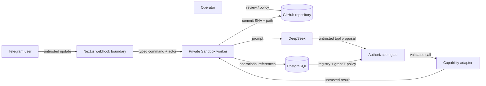
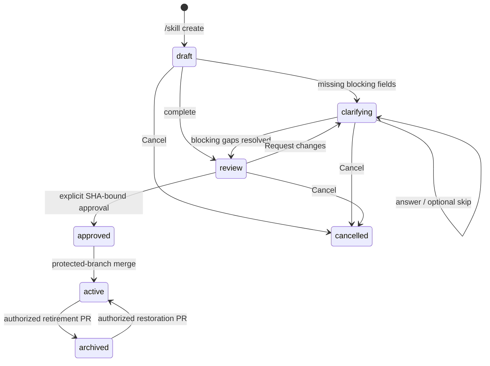

# Design: Installed Skills for Telegram Agent

Status: Approved target design; GitHub is canonical for skill definitions and the Sandbox filesystem is disposable.

## Architecture and trust boundaries

Next.js validates Telegram, GitHub webhook, and dashboard requests, then invokes a private Sandbox worker. GitHub is the sole durable definition store; PostgreSQL holds only operational references and audits through a least-privilege role. See `architecture.md` for the normative repository and storage contract.

```mermaid
flowchart LR
  U[Telegram user] -->|untrusted update| W[Next.js webhook boundary]
  O[Operator] -->|review / policy| G[(GitHub repository)]
  W -->|typed command + actor| S[Private Sandbox worker]
  S -->|commit SHA + path| G
  S -->|operational references| DB[(PostgreSQL)]
  S -->|prompt| M[DeepSeek]
  M -->|untrusted tool proposal| A[Authorization gate]
  DB -->|registry + grant + policy| A
  A -->|validated call| T[Capability adapter]
  T -->|untrusted result| S
```

Trust boundaries are explicit:

1. Telegram updates/callbacks are untrusted until webhook authentication, schema validation, actor extraction, and update-id deduplication.
2. Skill text, user input, model output, and tool output are untrusted data, never policy or executable adapter definitions.
3. The capability registry and operator policy are trusted control-plane data writable only by migrations/operator administration.
4. PostgreSQL credentials, Telegram/DeepSeek secrets, and capability credentials remain server-side and are injected only into the adapter that needs them.
5. The Sandbox is an execution boundary, not a durability boundary. Skill hydration uses a verified Git commit; operational recovery uses PostgreSQL references.
6. Dashboard authentication grants inspection, not skill ownership or capability execution; operator mutation uses a separate administrative path/role.

## Skill lifecycle state machine

```mermaid
stateDiagram-v2
  [*] --> draft: /skill create
  draft --> clarifying: missing blocking fields
  clarifying --> clarifying: answer / optional skip
  draft --> review: complete
  clarifying --> review: blocking gaps resolved
  review --> clarifying: Request changes
  review --> approved: explicit SHA-bound approval
  approved --> active: protected-branch merge
  active --> archived: authorized retirement PR
  archived --> active: authorized restoration PR
  draft --> cancelled: Cancel
  clarifying --> cancelled: Cancel
  review --> cancelled: Cancel
```

Draft and clarification changes commit to a short-lived branch. Review opens a pull request; approval binds the exact commit SHA, displayed capabilities, actor, update ID, and timestamp. GitHub required reviews/checks and branch protection authorize merge. A merge to the protected default branch activates that exact tree; stale callbacks or changed heads have no effect.

## PostgreSQL operational boundary

PostgreSQL stores conversations, selections, invocation/audit events, delivery/idempotency state, capability policy, and PR status only. A selection or execution identifies `skill_id`, repository/path, and full commit SHA. It must not contain model instructions, manifest content, revisions, drafts, diffs, searchable definition text, embeddings, or archived definitions.

Operational foreign keys and uniqueness constraints prevent duplicate effects, but Git/GitHub establishes definition integrity and approval. Catalog and ownership data are read from the validated manifest at the pinned commit, not a database search index. Restored references are unusable until their Git objects and paths are reconciled.

## Prompt precedence

The prompt assembler emits labeled, non-interpolated sections in this immutable high-to-low precedence:

1. platform safety rules compiled into the application;
2. operator policy and emergency capability disables;
3. capability registry constraints and effective grants;
4. the exact approved skill loaded from its selected Git commit SHA;
5. bounded conversation history;
6. current user input;
7. quoted tool output marked untrusted.

Lower-priority content may supply data but cannot redefine roles, authorize capabilities, reveal secrets, alter lifecycle/commit, or suppress audit. Tool output is encoded/delimited rather than concatenated as instructions. Prompt snapshots record hashes and commit SHAs, not secrets or hidden reasoning.

## Capability registry and authorization

`src/worker/capabilities/registry.ts` loads operator-defined descriptors. Adapters implement `prepare`, `execute`, and `sanitizeResult`; adapters cannot register themselves at runtime. `authorize.ts` computes:

`effective = registry.enabled ∩ operator_policy ∩ manifest_request ∩ actor_visibility ∩ parameter_schema ∩ confirmation`

Every term must allow the call. The decision and reason code are audited before dispatch. Risk-tier policy can require per-call Telegram confirmation bound to execution, call hash, user, and expiry. Capability disabling is an immediate kill switch checked again immediately before side effects. `model.generate` uses the same decision vocabulary but cannot confer another capability.

## Tool-execution loop

1. Resolve and validate the selected path at its full commit SHA, then begin `skill_executions` pinned to that SHA with key `execute:<update_id>:<commit_sha>:<skill_id>`.
2. Assemble the precedence-safe prompt and ask the model for either a final answer or one typed capability proposal.
3. Parse the proposal as data; reject unknown capability names or invalid JSON.
4. Authorize against current registry, policy, grant, visibility, budget, and confirmation. Persist the decision.
5. Reserve `tool:<execution_id>:<step_no>` before dispatch. For non-retry-safe calls, a lost response becomes `unknown_outcome` and is not replayed automatically.
6. Invoke the adapter with least-privilege credentials, timeout, egress policy, and external idempotency key where supported.
7. Sanitize and persist outcome, then append the untrusted result to the next model step.
8. Stop on a final response, denial, invalid response, cancellation, deadline, or `SKILL_MAX_TOOL_STEPS`; persist final status before idempotent Telegram delivery.

The model never invokes adapters directly. A tool result cannot recursively dispatch. Default limits are five steps and 60 seconds, configurable only within operator-approved bounds.

## Idempotency and recovery

| Boundary | Key | Recovery behavior |
|---|---|---|
| Webhook | `telegram:<update_id>` | Return recorded acknowledgment/resume processing. |
| Lifecycle | `transition:<update_id>:<skill_id>:<expected_commit_sha>` | Repeat original transition result; mismatched hash conflicts. |
| PR/merge | `publish:<skill_id>:<commit_sha>` | Return the existing PR/merge reference; never bypass checks. |
| Execution | `execute:<update_id>:<commit_sha>:<skill_id>` | Resume after the last committed step at the same immutable commit. |
| Tool | `tool:<execution_id>:<step_no>` | Replay only when descriptor says retry-safe or provider supports key; otherwise surface unknown outcome. |
| Delivery | `delivery:<execution_id>:<chunk_no>` | Store Telegram message ID and do not resend recorded chunks. |

Rows use a short processing lease so a crashed worker can be taken over. Reconciliation marks expired work resumable, checks recorded provider identifiers where supported, and never guesses success. Database unavailability prevents new external side effects. Sanitized user messages distinguish retryable/no-action, completed-but-delivery-failed, and unknown outcome.

## Telegram UX

- `/skill create` starts a private draft and displays its ID/name and current state.
- Clarification messages show category and `Required` or `Optional`, one question per turn, with **Skip optional** and **Cancel** buttons plus command fallbacks.
- Review is numbered and paginated if necessary. It always shows visibility, owner semantics, requested capabilities/risk and full commit SHA, followed by **Approve & install**, **Request changes**, and **Cancel**.
- Approval callbacks contain an opaque signed token for actor, skill, commit SHA, action, and expiry. Stale/tampered callbacks fail closed and show the current commit.
- `/skills` lists only visible active skills. `/skill find query` returns stable IDs. `/skill use <id> [commit-sha]` explicitly selects; name-only collisions display choice buttons and never auto-select.
- Before a run, Telegram states `Using <name> vN` and capability summary. Per-call confirmation names the capability and effect and offers **Allow once**/**Deny**.
- `/skill clear`, `/skill status`, `/skill history <id>`, and `/skill disable <id>` provide explicit control. Text command equivalents exist for every button.

## Deployment, repository recovery, and rollback

Deployment verifies schema/layout checks, CODEOWNERS, the GitHub ruleset, webhook authentication, and a repository mirror/bundle before code rollout. Capabilities remain disabled until a clean-clone smoke test resolves and validates the configured default-branch SHA.

Repository recovery restores a verified mirror/bundle, checks object reachability and protected-branch configuration, then uses reviewed revert/cherry-pick PRs for rollback. PostgreSQL snapshots cover operational references and audits only. `scripts/recovery-verify.mjs` reconciles every selected SHA/path and fails closed on missing or invalid objects before a stubbed dry-run execution.

## Design-to-requirement traceability

The normative requirement-to-module-to-test matrix is in `requirements.md`. The implementation tasks in `tasks.md` must keep that matrix current. CI fails release acceptance when any `SKILL-F-*` or `SKILL-NF-*` ID is absent from test metadata. This design specifically realizes lifecycle (`SKILL-F-001–010`), catalog/selection (`011–014`), capability/prompt/tool loop (`015–019`), version/ownership/audit/recovery (`020–024`), and GitHub authorization/recovery (`025–026`).
