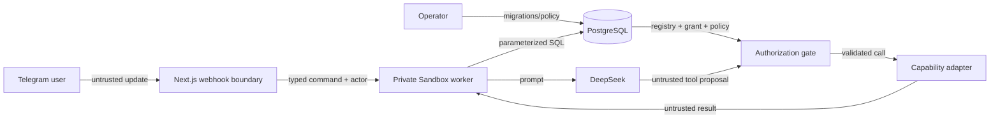
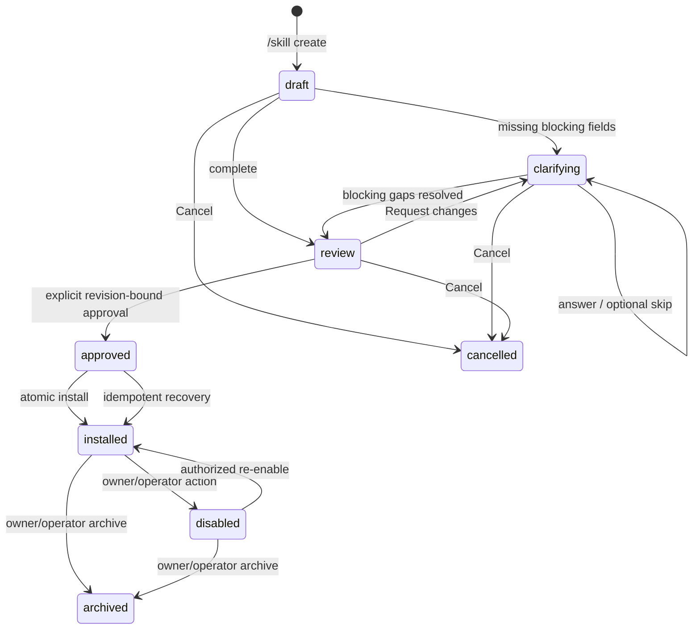

# Design: Installed Skills for Telegram Agent

Status: Approved target design; PostgreSQL is canonical and the Sandbox filesystem is disposable.

## Architecture and trust boundaries

Next.js validates Telegram and dashboard requests, then invokes a private Sandbox worker. PostgreSQL is the only durable store and is reached through a least-privilege application role. The worker orchestrates DeepSeek and registered capability adapters; it does not expose a public port.

```mermaid
flowchart LR
  U[Telegram user] -->|untrusted update| W[Next.js webhook boundary]
  O[Operator] -->|migrations/policy| DB[(PostgreSQL)]
  W -->|typed command + actor| S[Private Sandbox worker]
  S -->|parameterized SQL| DB
  S -->|prompt| M[DeepSeek]
  M -->|untrusted tool proposal| A[Authorization gate]
  DB -->|registry + grant + policy| A
  A -->|validated call| T[Capability adapter]
  T -->|untrusted result| S
```

Trust boundaries are explicit:

1. Telegram updates/callbacks are untrusted until webhook authentication, schema validation, actor extraction, and update-id deduplication.
2. Skill text, user input, model output, and tool output are untrusted data, never policy or executable adapter definitions.
3. The capability registry and operator policy are trusted control-plane data writable only by migrations/operator administration.
4. PostgreSQL credentials, Telegram/DeepSeek secrets, and capability credentials remain server-side and are injected only into the adapter that needs them.
5. The Sandbox is an execution boundary, not a durability boundary. Restart hydration comes from PostgreSQL.
6. Dashboard authentication grants inspection, not skill ownership or capability execution; operator mutation uses a separate administrative path/role.

## Skill lifecycle state machine

```mermaid
stateDiagram-v2
  [*] --> draft: /skill create
  draft --> clarifying: missing blocking fields
  clarifying --> clarifying: answer / optional skip
  draft --> review: complete
  clarifying --> review: blocking gaps resolved
  review --> clarifying: Request changes
  review --> approved: explicit revision-bound approval
  approved --> installed: atomic install
  approved --> installed: idempotent recovery
  installed --> disabled: owner/operator action
  disabled --> installed: authorized re-enable
  installed --> archived: owner/operator archive
  disabled --> archived: owner/operator archive
  draft --> cancelled: Cancel
  clarifying --> cancelled: Cancel
  review --> cancelled: Cancel
```

Each transition locks the skill row, checks actor/owner, expected state and expected revision, inserts an append-only `skill_events`/`audit_events` record, and commits with its idempotency record. Review content is an immutable revision. Approval binds `revision_id`, SHA-256 content hash, displayed capabilities, actor, update ID, and timestamp. Installation is a transaction that marks that exact version current and creates only the displayed grants. A stale callback returns the current state and has no side effect.

## PostgreSQL schema

All IDs are UUIDs except Telegram IDs (`bigint`); all timestamps are `timestamptz` UTC. JSON uses `jsonb` with application and database checks. Migration SQL lives in `db/migrations/` and is applied by `scripts/migrate.mjs`; production startup verifies `schema_migrations` but never creates schema.

| Table | Important columns and constraints |
|---|---|
| `schema_migrations` | `version PK`, `checksum`, `applied_at`; changed checksums fail startup. |
| `skills` | `id PK`, `owner_user_id NULL FK users`, `visibility CHECK(private,global)`, `name`, `normalized_name`, `lifecycle_state`, `current_version_id`, timestamps; private requires owner, global requires null owner/operator provenance. |
| `skill_revisions` | `id PK`, `skill_id FK`, `revision_no`, `content jsonb`, `content_hash`, `created_by`, `created_at`, `supersedes_id`; unique `(skill_id, revision_no)` and `(skill_id, content_hash)`; rows immutable. |
| `skill_clarifications` | `id`, `skill_id`, `revision_id`, `category CHECK(stable enum)`, `blocking`, `question`, `answer`, `status`; one active blocking prompt per skill. |
| `skill_approvals` | `id`, `skill_id`, `revision_id`, `approver_user_id`, `content_hash`, `capability_set_hash`, `telegram_update_id`, `approved_at`; unique revision approval/update. |
| `skill_versions` | `id`, `skill_id`, `version_no`, `revision_id`, `content_hash`, `status`, `installed_at`; unique `(skill_id, version_no)`; immutable. |
| `capabilities` | `key PK`, `adapter`, `risk_tier`, input/output JSON schemas, timeout, retry class, confirmation mode, redaction policy, `enabled`; operator-only writes. |
| `skill_capability_grants` | `skill_version_id`, `capability_key`, `grant_config`, `granted_by`, `granted_at`, `revoked_at`; composite PK; FK registry/version. |
| `conversation_skill_selections` | `conversation_id PK`, `skill_id`, `skill_version_id`, `selected_by`, `selected_at`, `cleared_at`; authorization rechecked at run start. |
| `skill_executions` | `id`, actor/conversation/skill/version IDs, `status`, `step_count`, deadline, correlation/idempotency keys, timestamps, sanitized failure. |
| `tool_calls` | `id`, `execution_id`, `step_no`, `capability_key`, parameter/result hashes, sanitized parameter/result JSON, confirmation/authorization/outcome, external idempotency key, timestamps; unique `(execution_id, step_no)`. |
| `idempotency_keys` | `(scope,key) PK`, actor, request hash, status, result reference, lease expiry, timestamps; same key plus different request hash is a conflict. |
| `audit_events` | `id`, actor type/id, action, target type/id, skill/version/execution IDs, correlation/idempotency keys, outcome, sanitized metadata, `occurred_at`; append-only role permissions. |

Indexes cover owner/visibility/state, normalized name and tags (GIN full-text), current version, execution/correlation, audit target/time, and expired idempotency leases. Ownership is enforced in repository predicates (private owner OR enabled global), with PostgreSQL row-level security enabled as defense in depth where the provider supports separate actor context. No API accepts `owner_user_id` from model output.

Existing logical JSONL records may remain as compatibility exports, but they are generated from PostgreSQL and are not a second source of truth.

## Prompt precedence

The prompt assembler emits labeled, non-interpolated sections in this immutable high-to-low precedence:

1. platform safety rules compiled into the application;
2. operator policy and emergency capability disables;
3. capability registry constraints and effective grants;
4. the exact approved, installed, selected skill version;
5. bounded conversation history;
6. current user input;
7. quoted tool output marked untrusted.

Lower-priority content may supply data but cannot redefine roles, authorize capabilities, reveal secrets, alter lifecycle/version, or suppress audit. Tool output is encoded/delimited rather than concatenated as instructions. Prompt snapshots record hashes and version IDs, not secrets or hidden reasoning.

## Capability registry and authorization

`src/worker/capabilities/registry.ts` loads operator-defined descriptors. Adapters implement `prepare`, `execute`, and `sanitizeResult`; adapters cannot register themselves at runtime. `authorize.ts` computes:

`effective = registry.enabled ∩ operator_policy ∩ version_grant ∩ actor_visibility ∩ parameter_schema ∩ confirmation`

Every term must allow the call. The decision and reason code are audited before dispatch. Risk-tier policy can require per-call Telegram confirmation bound to execution, call hash, user, and expiry. Capability disabling is an immediate kill switch checked again immediately before side effects. `model.generate` uses the same decision vocabulary but cannot confer another capability.

## Tool-execution loop

1. Begin `skill_executions` pinned to the selected immutable version and store idempotency key `execute:<update_id>:<skill_version_id>`.
2. Assemble the precedence-safe prompt and ask the model for either a final answer or one typed capability proposal.
3. Parse the proposal as data; reject unknown capability names or invalid JSON.
4. Authorize against current registry, policy, grant, visibility, budget, and confirmation. Persist the decision.
5. Reserve `tool:<execution_id>:<step_no>` before dispatch. For non-retry-safe calls, a lost response becomes `unknown_outcome` and is not replayed automatically.
6. Invoke the adapter with least-privilege credentials, timeout, egress policy, and external idempotency key where supported.
7. Sanitize and persist outcome, then append the untrusted result to the next model step.
8. Stop on a final response, denial, invalid response, cancellation, deadline, or `SKILL_MAX_TOOL_STEPS`; persist final status before idempotent Telegram delivery.

The model never invokes adapters directly. A tool result cannot recursively dispatch. Default limits are five steps and 60 seconds, configurable only within operator-approved bounds.

## Idempotency and recovery

| Boundary | Key | Recovery behavior |
|---|---|---|
| Webhook | `telegram:<update_id>` | Return recorded acknowledgment/resume processing. |
| Lifecycle | `transition:<update_id>:<skill_id>:<expected_revision>` | Repeat original transition result; mismatched hash conflicts. |
| Install | `install:<skill_id>:<revision_id>` | Return installed version or finish approved transaction. |
| Execution | `execute:<update_id>:<version_id>` | Resume after last committed step with same pinned version. |
| Tool | `tool:<execution_id>:<step_no>` | Replay only when descriptor says retry-safe or provider supports key; otherwise surface unknown outcome. |
| Delivery | `delivery:<execution_id>:<chunk_no>` | Store Telegram message ID and do not resend recorded chunks. |

Rows use a short processing lease so a crashed worker can be taken over. Reconciliation marks expired work resumable, checks recorded provider identifiers where supported, and never guesses success. Database unavailability prevents new external side effects. Sanitized user messages distinguish retryable/no-action, completed-but-delivery-failed, and unknown outcome.

## Telegram UX

- `/skill create` starts a private draft and displays its ID/name and current state.
- Clarification messages show category and `Required` or `Optional`, one question per turn, with **Skip optional** and **Cancel** buttons plus command fallbacks.
- Review is numbered and paginated if necessary. It always shows visibility, owner semantics, requested capabilities/risk, revision, and hash prefix, followed by **Approve & install**, **Request changes**, and **Cancel**.
- Approval callbacks contain an opaque signed token for actor, skill, revision, action, and expiry. Stale/tampered callbacks fail closed and show the current revision.
- `/skills` lists only visible installed skills. `/skill find query` returns stable IDs. `/skill use <id> [version]` explicitly selects; name-only collisions display choice buttons and never auto-select.
- Before a run, Telegram states `Using <name> vN` and capability summary. Per-call confirmation names the capability and effect and offers **Allow once**/**Deny**.
- `/skill clear`, `/skill status`, `/skill history <id>`, and `/skill disable <id>` provide explicit control. Text command equivalents exist for every button.

## Deployment, migration, backup, and rollback

Deployment order is backup → migrate with migrator role → verify schema/checksum → deploy code → smoke test with capabilities disabled → enable registry entries → register webhook. Migrations are forward-compatible expand/migrate/contract changes. The application role has DML only; registry administration and migrations use separate roles.

`scripts/backup.mjs` requests a provider-consistent PostgreSQL snapshot/`pg_dump` including skill tables. `scripts/restore-verify.mjs` restores only to an isolated database, validates migration checksums, FK/row counts/content hashes, private visibility, current-version pointers, grants, audit events, and a dry-run execution with stub adapters. Rollback disables Telegram and capabilities first. Code rollback is allowed only while it understands the installed schema; database down-migrations are avoided in favor of a tested full restore.

## Design-to-requirement traceability

The normative requirement-to-module-to-test matrix is in `requirements.md`. The implementation tasks in `tasks.md` must keep that matrix current. CI fails release acceptance when any `SKILL-F-*` or `SKILL-NF-*` ID is absent from test metadata. This design specifically realizes lifecycle (`SKILL-F-001–010`), catalog/selection (`011–014`), capability/prompt/tool loop (`015–019`), version/ownership/audit/recovery (`020–024`), and database operations (`025–026`).
